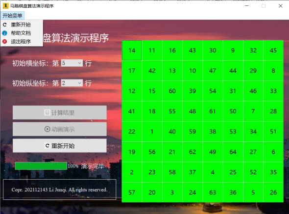

# 【数据结构】课程设计：马踏棋盘

本课程设计使用了栈来记录马行进的路线，使用while循环控制马遍历的次数以实现对棋盘的非递归遍历，并利用了QT设计应用程序界面，实现了算法的可视化。
**其中AssiTest.exe为程序的安装包，AssiTest目录为QT工程目录。**

# 设计任务及要求

任务：设计一个国际象棋的马踏遍棋盘的演示程序。

要求：将马随机放在国际象棋的8×8棋盘Board的某个方格中，马按走棋规则进行移动。要求每个方格只进入一次，走遍棋盘上全部64个方格。编制非递归程序，求出马的行走路线，并按求出的行走路线，将数字1，2，…，64依次填入一个8×8的方阵，并输出。

# 设计主体

## 需求分析

用户输入马在棋盘中的起始位置，程序需要不断遍历寻找棋子的落点，最终在棋盘上用1至64的标号来呈现马遍历棋盘的过程。

程序流程图和函数流程图如图1和图2所示。

本程序以马的起始位置坐标(i, j)作为输入，其中1<=i, j<=8，同时以带有标号的棋盘作为程序的输出。程序能够根据给定的起始位置坐标进行循环遍历，找到马完全遍历棋盘的路线。若输入输入的起始坐标满足条件1<=i, j<=8，则输入正确，需要输出马遍历棋盘的完整路线，否则输入错误，需要输出对应的指示引导使用者重新输入。

## 系统设计

### 马的走棋规则

如图3所示，当马的起始位置(i, j)确定的时候，可以走到下列8个位置之一：

(i-2,j+1)、(i-1,j+2)、(i+1,j+2)、(i+2,j+1)、(i+2,j-1)、(i+1,j-2)、(i-1,j-2)、(i-2,j-1)

因此规定移动矩阵Move如下表1所示。

| Move  | 0    | 1    | 2    | 3    | 4    | 5    | 6    | 7    |
| ----- | ---- | ---- | ---- | ---- | ---- | ---- | ---- | ---- |
| MoveX | -2   | -1   | 1    | 2    | 2    | 1    | -1   | -2   |
| MoveY | 1    | 2    | 2    | 1    | -1   | -2   | -2   | -1   |

### 数据结构定义

本课程设计使用到的数据结构定义如下：

模块说明：

函数调用关系图：

主程序伪代码：

主要模块伪代码：

## 系统实现

### 算法实现

* 第一步：用户输入马的起始坐标（i, j），其中1<=i, j<=8。

* 第二步：初始化栈Stack，将起始点进栈；

* 第三步：利用移动矩阵Move顺时针搜索P0附近的8个方向，并计算每个方向的下一个位置对应的权值。此处定义权值为该点可行方向的数量；定义点的index值为0；

* 第四步：将得到的权值存入direction数组中，并判断该数组是否为空；

* 第五步：若direction数组不为空，则对direction数组进行快速升序排序，根据index的值，优先访问权值最小的可行方向，将可行点进栈，计数器order自增1；若direction数组为空，说明该点已无可行方向，此时需要进行退栈操作，计数器order自减1，direction数组的指针index自增1，并对刚刚退出栈顶的点重新进行搜索。

* 重复第三、四、五步，直到order>64时循环结束。

* 第六步：利用双重for循环遍历输出Board二维数组。

### 程序调试中遇到的问题

1.  遍历过程进入死循环

在改进算法前，算法在8个方向的搜索规则是：若存在可行的方向，则前进，否则后退。然而，当该点有且只有一个可行方向，且下一个方向对应的点无可行方向时，马会前进到下一个点，而因无可行方向回退，重新搜索时又会前进到这个“死胡同”。

因此，考虑到要提升程序运行的效率，就需要重新制定遍历规则，减少棋子回溯的次数，尽量使其能够一次性遍历整个棋盘。新的规则即是计算该点8个可行方向下的下一个点的权值，并优先访问权值较小的方向，进而减少回溯的次数，提升算法的运行效率。

2. 算法可视化时程序崩溃

在实现算法以后，考虑将本算法移植到QT工程中实现可视化的应用程序。在移植的过程中，我设计了程序的ui界面，使用connect函数连接信号与槽，同时创建了一个ChessBoardProblem类用于算法运行。然而在点击“计算结果”按键时，程序无响应。

后来通过debug调试过程发现程序因使用了未定义的变量而产生异常，原因是我将原程序的全局变量定义为了ChessBoardProblem类的私有成员变量，导致函数之间的调用时存在变量值未更改的问题。我将私有成员变量设置为静态私有成员变量后，程序不再崩溃。

### 对设计与实现的回顾

本题要求使用非递归算法实现马踏棋盘的遍历计算，因此在算法中使用while循环来控制棋子的遍历次数。当order大于64时说明棋盘已遍历完成，此时需要退出while循环。

同时，算法使用栈这一基本数据结构实现“回溯”功能。当马向下一个点前进时，将下一个点的信息进行入栈操作；而当马后退时，需要弹出栈顶元素并进行重新搜索。最终实现了马的“回溯”功能。

### 算法的时空分析和改进思想

在8×8的棋盘Board中，根据现有的搜索规则，程序对给定的初始点绝大部分可以在无需回溯的条件下遍历完整个棋盘。只有当初始点为(4, 2)时，程序发生回溯。

算法能够通过进一步优化遍历规则，减少无效的搜索次数和棋子回溯的次数，尽量使其能够一次性遍历整个棋盘。

### QT Creator的分文件结构

## 用户手册

如图6所示，在本次数据结构课程设计中使用QT Creator软件制作了算法的可视化界面。通过选定初始点的横坐标和纵坐标，即可对算法进行遍历计算，进而呈现马遍历棋盘的完整路线。

如图7所示，本次以初始点(5, 2)为例子，选定初始横坐标为5，初始纵坐标为2，点击“计算结果”按钮，对棋子的运行路线进行遍历计算。

上图清晰呈现了马从(5, 2)点遍历全棋盘的次序，此时点击“动画演示”按键可以逐步呈现马的行走路线。如图所示，棋盘中红色格子代表马所在的位置，绿色格子代表马已经走过的位置。

演示完毕。若需要重新演示，可以点击棋盘旁的“重新开始”按钮或点击“开始菜单”中的“重新开始”按钮重新选择测试用例。

点击“开始菜单”的帮助文档按钮可以查询马踏棋盘中马的行走规则和程序的相关使用方法。

# **参考资料**

[1] 谭浩强.(2015).C++程序设计（第三版）.清华大学出版社.

[2] 严蔚敏.(1997).数据结构（C语言版）.清华大学出版社.
